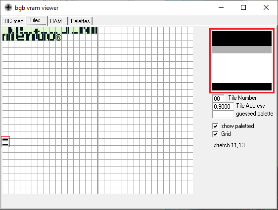

### Manual loading

We want to load a full black sprite on VRAM.  
Instead, what we get is this:

This is because we are not turning off the screen.
It's somewhat curious that we get something, because we shouldn't be able to write to VRAM with the screen turned on.

Next, we are going to turn off the screen before writting to VRAM.
