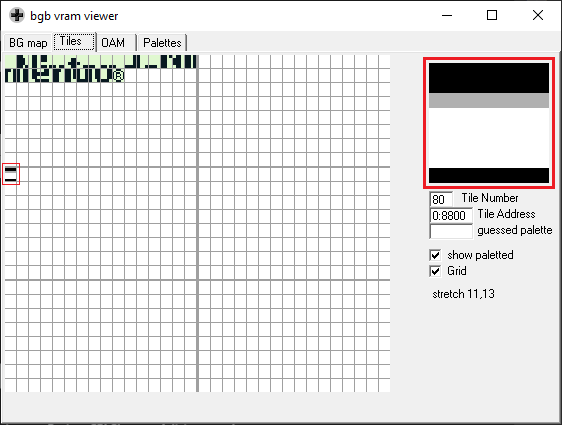
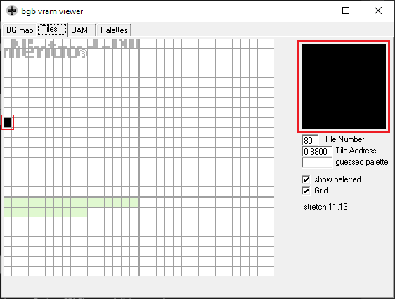

### Manual loading

_**WARNING:** don't reproduce this code in a real hardware, it can break your GameBoy._

We want to load a full black sprite on VRAM.  
Instead, what we get is this:

This is because we are not turning off the screen.
It's somewhat curious that we get something, because we shouldn't be able to write to VRAM with the screen turned on.

Next, we are going to turn off the screen before writting to VRAM.

### Wait for VBlank

We go through four steps:
1. wait for VBlank
2. turn off the LCD
3. write the sprite into VRAM
4. turn on the LCD

After that, we get:

It worked!

For now, let's keep the screen empty, we'll show a sprite in it later.