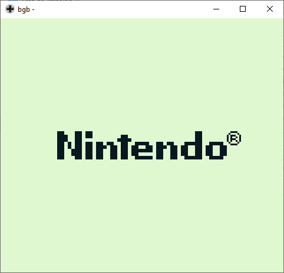
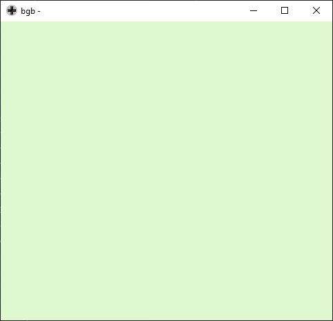

### Manual loading

We want to load a full black sprite on VRAM.  
Instead, what we get is this:

| | |
| --- | --- |
|  |  |

This is because we are not turning off the screen.
It's somewhat curious that we get something, because we shouldn't be able to write to VRAM with the screen turned on.

Next, we are going to turn off the screen before writting to VRAM.

### Wait for VBlank

We go through four steps:
1. wait for VBlank
2. turn off the LCD
3. write the sprite into VRAM
4. turn on the LCD

After that, we get:

| | |
| --- | --- |
|  |  |

It worked! (well, kind of ...)

The sprite **is** in VRAM, but the screen is now empty.  
What happened is that when we turned off the screen and turned on again, the game boy loaded the sprites from another address.  
For now, let's keep it this way. We'll handle it later, when printing a sprite on the screen.