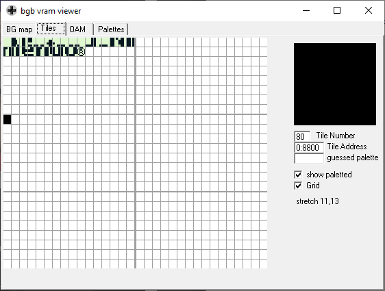

*Note: `db` and `INCBIN` may not be recognized by all assemblers. I'm using [RGBDS](github.com/rednex/rgbds).*

### Using **db** instruction

In the codes from [Image on VRAM](../02_ImageOnVram) we loaded the sprite bytes line by line. We are now gonna see a most elegant way to load sequential bytes using the `db` instruction.

As we can see, we get the same result as before, but with a much cleaner code.

### Loading from file

Better than having all the sprite bytes wrote into the code, we can define them in files and load them from the file.  
This can be achieved using the `INCBIN` instruction.

Again, we get the same result.