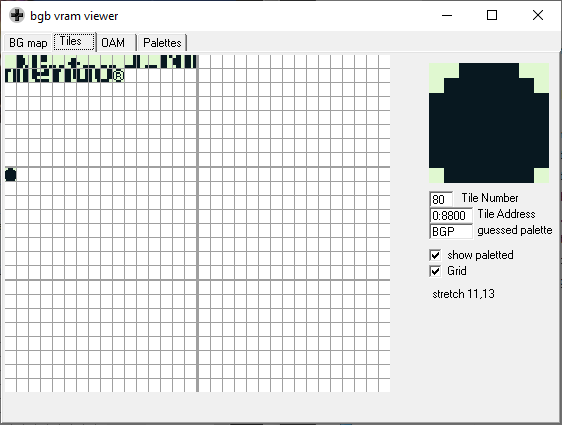
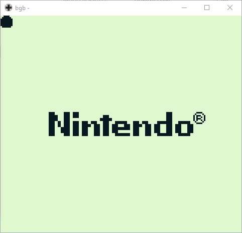
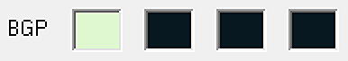
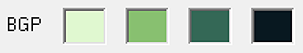
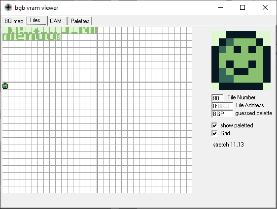
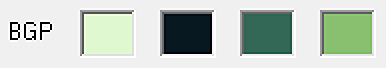
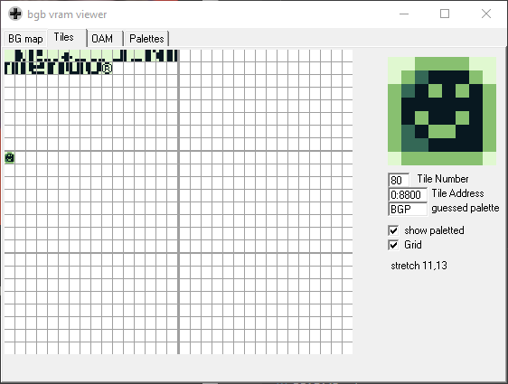
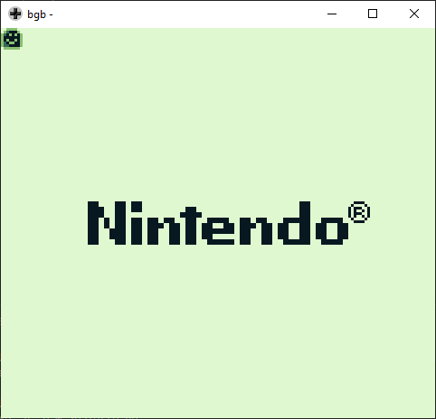

### Image on screen

We are going to show this smile tile on screen.


The GameBoy way of defining a tile is [not very intuitive](https://www.huderlem.com/demos/gameboy2bpp.html).
Our smile image is defined by:

```
    db $3C, $3C, $5E, $62
    db $BF, $D5, $FF, $81
    db $FF, $A5, $BF, $D9
    db $9F, $E1, $7E, $7E
```

After loading it into the left most tile, address `$9800`, we get an image on screen!

| | |
| --- | --- |
|  |  |

Well, it was not the smile I was hoping...  
This happened because we are using the background palette (BGP) already set:



To correctly print the colors, we should set a new BGP.

*Note: the previous palette had the value of `%11111100`.*


### Setting a palette

The address `$FF47` holds the BGP register. We set it to `%11100100` to get our desired palette:



Then, we get the intended results:

| | |
| --- | --- |
|  |  |

Now, we could just play with the palettes and see the results we get.


### Setting a different palette

I changed the palette only to show a different result.



With this palette, we get:

| | |
| --- | --- |
|  |  |
