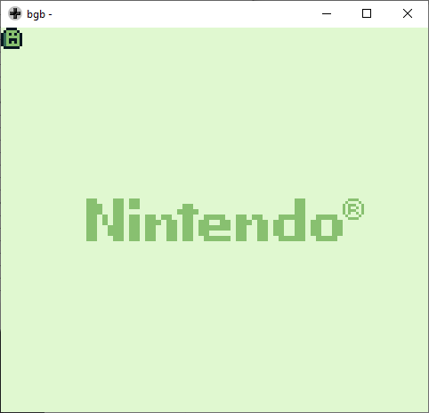

### Constants

This is a more quality of life feature that is possible using RGBDS's `EQU` instruction.  
Here, we present the same code from the [last implementation](../04_ImageOnScreen), but defining the addresses more pleasantly.

*Note: there are plenty of ways to define* shortcuts *in RGBDS, `EQU` is just one of them. Specifically, `EQU` does not allow a constant to be redefined. If you want to know more about symbols, you can see the [documentation](https://rednex.github.io/rgbds/rgbasm.5.html).*

