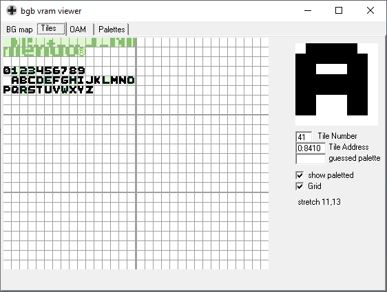
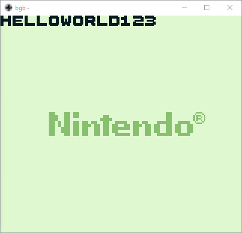

### Hello World

*First of all, I want to say that these codes are based on [Eldred's fantastic tutorial](https://eldred.fr/gb-asm-tutorial/hello-world.html). However, I wanted to fully understand what was going on, so I broke it in some pieces that were more understandable for me.*

Instead of writing the tiles into arbitrary VRAM addresses, we'll use the fact that ASCII codes are predefined and use them to our advantage.  
When we load a character in code, we actually load its ASCII address. For example, "P" is `$50`.  
Thus, if we load the tile for the letter "P" in VRAM tile number `$50`, we'll have the correct character in its corresponding address.

| | |
| --- | --- |
|  |  |

### Load the string 

In the first code, we loaded each character directly into the correct address.  
Although this gives us the expected result, it is very annoying to load them one by one.  

The next improvement is to define the string using the command `db`, as we did [previously](../03_LoadBytes).  
However, instead of defining an ending address and counting the number of characters already loaded, we use the value `0` as the ending character (`\0` character on C strings).

Thus, we loop through the characters of the string until we find a `0`. The final result remains the same.

*Note: we could use any value as the ending character. For instance, [pokémon codes](https://github.com/pret/pokeyellow) seem to use `@`.*

### Charmap

It's a bit inconvenient to ensure that the font addresses are paired with ASCII codes. Moreover, this could imply in unused VRAM space (as we can see in the empty tiles between `9` and `A` on the previous image).  
There is an RGBDS instruction that helps us with this problem, called [charmap](https://rednex.github.io/rgbds/rgbasm.5.html#Character_maps).

As the name suggests, it maps a char (or string) to the indicated address.  
This way, we could point the characters to different addresses than ASCII codes.

Note in the images below that the blank space between the numbers and the letters is gone, but the result on the screen is the same.

| | |
| --- | --- |
|  |  |
