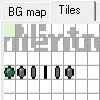
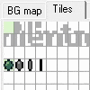
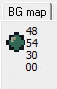
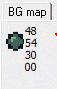

Using a tilemap, we can reduce memory usage.

| | | |
| --- | --- | --- |
|  |  |  |

You can see the comparison between the old version, with all sprites in memory, and the tilemap version below.

| | Full Version | Tilemap Version |
| --- | :---: | :---: |
| Tiles |  |  |
| OAM |  |  |