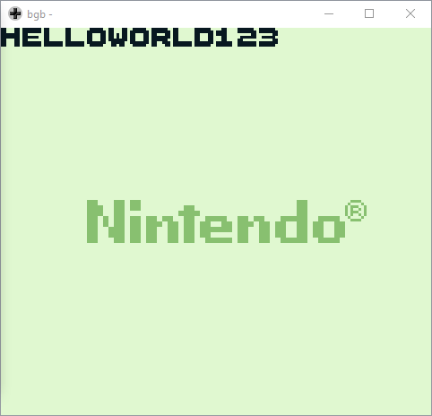
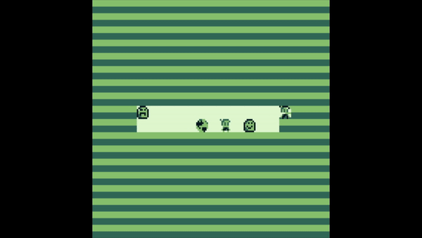
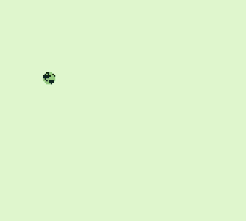

| Hello World | Horizontal Scroll | Inputs |
| --- | --- | --- |
|  |  |  |

### Roadmap

- [x] 1. Turn on Screen [~~_Code_~~] [~~_Readme_~~]
- [x] 2. Manually load a tile on VRAM [~~_Code_~~] [~~_Readme_~~]
- [x] 3. Load bytes using functions [~~_Code_~~] [~~_Readme_~~]
- [x] 4. Image on screen [~~_Code_~~] [~~_Readme_~~]
- [x] 5. Constants [~~_Code_~~] [~~_Readme_~~]
- [x] 6. Print text [~~Code~~] [~~_Readme_~~]
- [ ] 7. Clear the screen [_Code_] [_Readme_]
- [ ] 8. Functions [_Code_] [_Readme_]
- [ ] 9. Scrolling [~~Code~~] [_Readme_]
- [ ] 10. Basic inputs with scroll [~~_Code_~~] [_Readme_]
- [ ] 11. Sprite on screen [_Code_] [_Readme_]
- [ ] 12. Animation [_Code_] [_Readme_]
- [ ] 13. Advanced input handling [_Code_] [_Readme_]
- [ ] 14. Create a menu [_Code_] [_Readme_]
- [ ] 15. Audio [_Code_] [_Readme_]