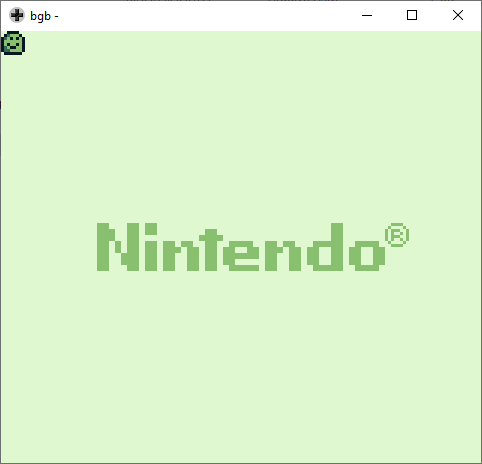
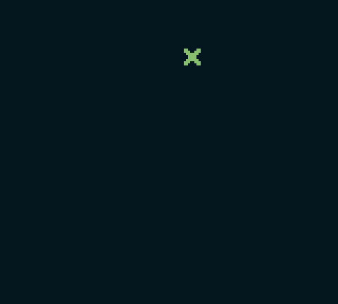
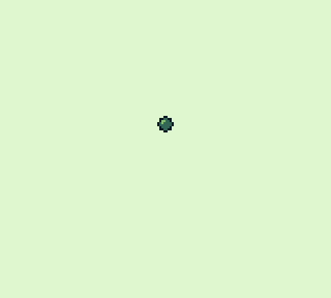

*__Disclaimer__: this repository is a record of my learning process and not a set of tutorials for beginners. If you want to learn how to create your own GB games, the best advice I have for you is to take a look at this really [awesome GB-dev resources](https://github.com/gbdev/awesome-gbdev).*

| [01 Turn On](01_TurnOn) | [04 Image on screen](04_ImageOnScreen) | [06 Print text](06_PrintText) |
| :---: | :---: | :---: |
|  |  |  |

| [09 Background Scroll](09_BackgroundScroll) | [12 Inputs](12_Inputs) | [13 Animation](13_Animation) |
| :---: | :---: | :---: |
|  |  | 

### Roadmap

- [x] 1. [Turn on Screen](01_TurnOn) [~~_Code_~~] [~~_Readme_~~]
- [x] 2. [Manually load a tile on VRAM](02_ImageOnVram) [~~_Code_~~] [~~_Readme_~~]
- [x] 3. [Load bytes using functions](03_LoadBytes) [~~_Code_~~] [~~_Readme_~~]
- [x] 4. [Image on screen](04_ImageOnScreen) [~~_Code_~~] [~~_Readme_~~]
- [x] 5. [Constants](05_Constants) [~~_Code_~~] [~~_Readme_~~]
- [x] 6. [Print text](06_PrintText) [~~_Code_~~] [~~_Readme_~~]
- [x] 7. [Clear the screen](07_ClearScreen) [~~_Code_~~] [~~_Readme_~~]
- [x] 8. [Functions](08_Functions) [~~_Code_~~] [~~_Readme_~~]
- [x] 9. [Scrolling](09_BackgroundScroll) [~~_Code_~~] [~~_Readme_~~]
- [ ] 10. [Basic inputs (scrolling bg)](10_BasicInputs) [~~_Code_~~] [_Readme_]
- [ ] 11. [Sprite on screen](11_SpriteOnScreen) [~~_Code_~~] [_Readme_]
- [ ] 12. [Inputs (moving sprites)](12_Inputs) [~~_Code_~~] [_Readme_]
- [ ] 13. [Animation](13_Animation) [~~_Code_~~] [_Readme_]
- [ ] 14. [Tilemaps](14_Tilemap) [~~_Code_~~] [_Readme_]
- [ ] 15. Code optimization [_Code_] [_Readme_]
- [ ] 16. Create a menu [_Code_] [_Readme_]
- [ ] 17. Audio [_Code_] [_Readme_]

## Projects

### Conway's Game of Life

This is my first project using GB ASM concepts. You can find the code [here](https://github.com/paulobruno/GbAsmConwaysGameOfLife).

